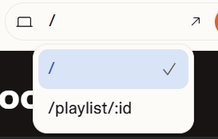

# Background

Here is a website builder consisting of a web interface where you can prompt descriptions of the websites built. This website then sends the request to the backend running on Modal which in turn spins up a sandbox where we run Claude Code to write the agent.

Now, we want to add functionality to this product. Read the task below to understand the objective.

# Task

Implement a hierarchical dropdown in the Next.js frontend that displays all HTML pages in the generated website, broken down into

1.  Users can navigate both between pages AND to specific sections within pages.

2. (Optional, extra assignment / discussion point) Internal routes within each page (hash routes, anchor links, navigable sections)

We will then meet and discuss the approach to the problem and what ways there are to solve this.

# Getting started with the repo

## Setup Backend

This project uses Modal for serverless deployment:

1. Install uv: `curl -LsSf https://astral.sh/uv/install.sh | sh`
2. Run `uv sync`
3. Run `uv run modal setup` to connect your Modal account
4. Add your Anthropic API key as a Modal secret: `modal secret create anthropic-secret ANTHROPIC_API_KEY=sk-...`
5. Deploy: `uv run modal deploy API.py`
6. Find your backend URL in the Modal dashboard

## Setup Frontend

1. Install pnpm: `npm install -g pnpm`
2. Navigate to the frontend: `cd appandrunning`
3. Create `.env.local` with: `NEXT_PUBLIC_API_URL=https://your-modal-url.modal.run`
4. Install dependencies: `pnpm i`
5. Run dev server: `pnpm run dev`
6. Open http://localhost:3000

## How It Works

1. User describes a website they want to build
2. A Modal sandbox spins up and serves html
3. Claude AI generates the HTML/CSS/JavaScript
4. The website is displayed live in an iframe
5. User can iterate with additional prompts
