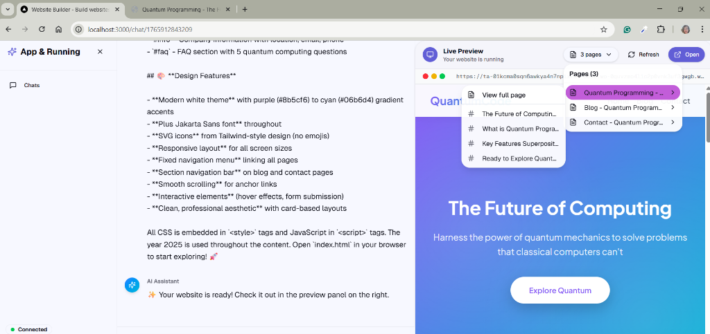

# Quantum Programming Website - Test Prompt

Use this prompt to test the Page Selector feature. It creates a multi-page website with navigation sections.

---

## Prompt

```
Create a multi-page website about Quantum Programming with the following pages:

1. index.html - Landing page with:
   - Hero section with headline "The Future of Computing"
   - About section explaining quantum programming
   - Features section with 4 cards
   - Call-to-action linking to blog

2. blog.html - Blog page with:
   - Grid of 6 article cards about quantum computing news
   - Each card has title, excerpt, date, and "Read more" link
   - Section headers with IDs for navigation (#latest, #featured)

3. contact.html - Contact page with:
   - Contact form (name, email, message)
   - Company information section with ID "info"
   - FAQ section with ID "faq"

Requirements:
- Modern white theme with purple/cyan gradient accents
- Use the font Jakarta
- Do not use emojis anywhere, use icons from tailwind css
- The year is 2025
- Responsive design
- Navigation menu linking all pages
- Each page should have sections with IDs for anchor navigation
```

---

## Expected Result

After generation, the Page Selector should show:

| Page | Sections |
|------|----------|
| index.html | hero, about, features, cta |
| blog.html | latest, featured |
| contact.html | info, faq |

---

## Test Access

**Live Preview URL:** https://ta-01kcma0sqn6awkya4n7np1xzd4-3000.wo-0quvzmo4l1c2p0vnk3uf3gwgb.w.modal.host/

---

## Result Screenshot


